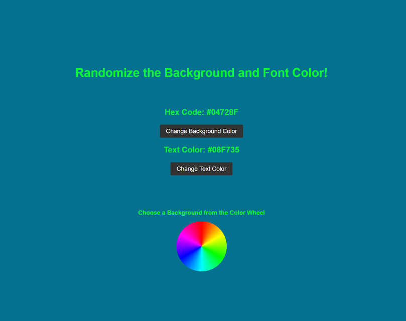

# Color Randomizer

## Project Overview

Color Randomizer is a simple web application that allows the user to generate a random color for the background or text of the webpage. It's built using HTML, CSS, and JavaScript.

## Changelog

v1.0 (2023-05-23)
Initial release of Color Randomizer
Basic functionality to generate random background and text colors
Display hexadecimal codes of generated colors
Interactive color wheel for background selection

## Demo

{:height="300px" width="500px"}

## Technologies Used

- HTML
- CSS
- JavaScript

## Features

- Generate random background colors
- Generate random text colors
- Display the hexadecimal codes of the generated colors
- Interactive color wheel for background selection

## Project Structure

```
|-- index.html
|-- main.css
|-- colorWheel.js
|-- bgGenerator.js
|-- colorRandomizerScreenshot.png
|-- README.md
```

## Development Process

During the development of the Color Randomizer, I focused on how to work with strings in JavaScript to create a randomized hexadecimal code. I utilized JavaScript's `Math.random()` function to generate a random string with 6 digits from the string "0123456789ABCDEF". This was the first time I used a string like an array, and built my own data out of the string. I also used event listeners to handle user interactions and dynamically update the hex codes, and the background and text colors.
The color wheel also challenged me to learn about using .getBoundingClientRect() and Math.atan2(). Overall, this project helped me solidify my understanding of JavaScript string and DOM manipulation.

## Future Enhancements

- Implement additional color formats displayed, such as HSL and RGB
- Update the Hex code when using the color wheel
- Create a contrast score or implement no contrast prevention

## Getting Started

To run the project locally, follow these steps:

1. Clone the repository: `git clone https://github.com/Ryan-Biondo/color-randomizer`
2. Navigate to the project directory: `cd color-randomizer`
3. Open `index.html` in your web browser.

## Usage

- Click the "Generate Background Color" button to randomly change the background color of the webpage.
- Click the "Generate Text Color" button to randomly change the text color of the webpage.
- The hexadecimal codes of the generated colors will be displayed above the buttons.

## Contributing

Contributions to this project are currently not accepted. However, if you have any suggestions or feedback, please feel free to reach out to me.

## License

All rights reserved. This project's code and content are protected under copyright law. You may not reproduce, modify, or distribute the code or content without explicit permission from the project author.

## Acknowledgments

- [Sean Craig Creative](https://seancraigcreative.com/) for inspiration.
